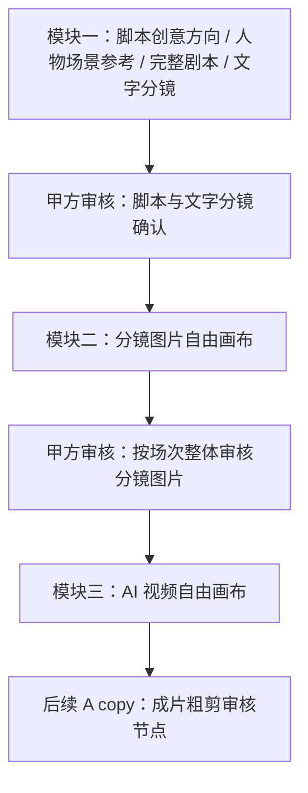
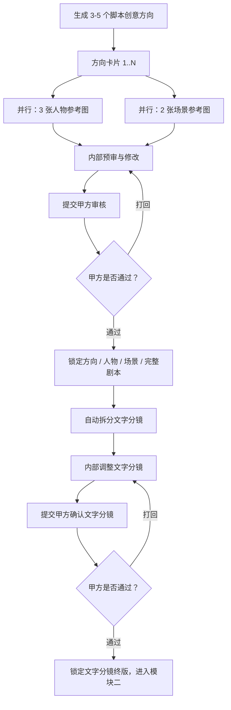

# 第 5-9 节点合并后三大模块 PID 与技术路线图

更新时间：2026-06-24

本文是当前最新口径，覆盖并替代旧计划中“5-9 步只做占位”的描述。原第 5-9 节点不再作为五个独立业务阶段实现，而是合并成三个可跑通的生产模块。

## 1. 总目标

将脚本确认、分镜图片生成、AI 视频生成整理成一条可持久化、可审核、可回溯、可冒烟验证的真实生产链路。

三大模块：

1. 脚本创意方向、人物/场景参考、完整剧本与文字分镜确认
2. 分镜图片自由画布
3. AI 视频自由画布

横切能力：

- 甲方外部审核模块：不要求甲方登录，通过安全链接 + 验证码/密钥访问；所有选择、反馈、打回、确认和历史版本必须回写内部端。
- 该模块已设计为全流程复用能力，不只服务 5-9：前置商业流程中的 Brief、完整项目提案、报价、合同也使用同一套审核任务、审核明细、安全链接和回写机制。

技术路线：

- 主工作台：React + shadcn/ui 固定结构
- 流程总览：`@xyflow/react`
- 标注/批注/图层增强：Konva / React Konva
- 视频生成 provider：火山方舟视频生成异步任务 API
  - 创建任务：`POST /api/v3/contents/generations/tasks`
  - 查询任务：`GET /api/v3/contents/generations/tasks/{id}`
  - 当前模型：`doubao-seedance-1-5-pro-251215`
  - 说明：虽然部分官方示例展示为 `doubao-seedance-1-5-Pro-251215`，当前账号 `/models` 返回的可用 ID 为全小写 `doubao-seedance-1-5-pro-251215`，业务配置以 `/models` 返回值为准。
  - 成功后从官方响应字段 `content.video_url` 下载 MP4 并转存 OSS

## 2. 核心流程



当前只有模块一、模块二会阻断流程推进；模块三只做内部确认，不生成甲方外链。A copy 指成片粗剪，是后续环节，不属于本次 5-9 合并范围。

## 3. 模块一：脚本创意方向与文字分镜确认

### 3.1 关键口径

- 平台生成 3-5 个脚本创意方向。
- 每个脚本创意方向下，人物参考图和场景参考图是并行关系，而不是先后关系。
- 每个脚本创意方向对应：
  - 3 个不同风格人物参考图
  - 2 个不同风格场景参考图
- 人物参考图、场景参考图都挂在对应脚本创意方向下。
- 甲方确认后，锁定脚本方向、人物参考、场景参考、完整剧本。
- 完整剧本确认后，系统拆分文字分镜；内部团队可调整；文字分镜必须甲方确认后才能进入模块二。

### 3.2 模块一流程图



### 3.3 文字分镜字段

每条文字分镜必须至少包含：

- 唯一编号 / 分镜编号
- 所属场次
- 画面内容
- 景别、动作与表情
- 机位与运镜
- 时长
- 声音与转场
- 备注信息
- 涉及人物
- 涉及场景
- Prompt 草稿
- 状态与版本

## 4. 模块二：分镜图片自由画布

### 4.1 关键口径

模块二内部工作方式是“逐条分镜工作台”，但甲方审核按“场次”整体提交。

- 内部创作：逐条分镜生成、筛选、修改。
- 甲方审核：按场次打包提交。
- 审核结果：场次整体通过或整体打回。
- 场次打回时，必须保留场内每条分镜的详细评分、OK/不 OK、修改意见。
- 不做“甲方只通过部分分镜后流程继续推进”的局部流转；只有该场次整体通过后，该场次才锁定。

### 4.2 排版布局

模块二必须对应用户参考图一的布局意向：

- 顶部黑色区：当前分镜内容 + 图片 Prompt
- 中央红色区：当前分镜生成图 / 正式候选图
- 右侧绿色区：按分镜顺序排列的成果资产缩略图
- 底部蓝色区：确认、修改、重新生成、提交场次审核等流转按钮

主界面使用 React + shadcn/ui 固定结构实现；Konva 只用于图片标注、圈选和图层批注增强，不承载整个工作台。

## 5. 模块三：AI 视频自由画布

### 5.1 关键口径

模块三只做内部确认，不触发甲方审核，不生成甲方外链。它服务于后续 A copy 粗剪。

每条已确认分镜图可以生成多个视频候选，内部团队选择一个作为正式视频资产。

### 5.2 排版布局

模块三必须对应用户参考图二的布局意向：

- 顶部黑色区：当前视频生成 / 播放区
- 中部红色区：视频 Prompt + 画面内容描述
- 底部蓝色区：当前分镜生成出的不同视频候选缩略图，生成几个显示几个
- 右侧绿色区：按分镜顺序排列的最终视频资产缩略图

## 6. 外部审核模块

甲方不登录内部团队端。审核访问方式：

- 安全链接
- token 哈希落库
- 验证码 / 密钥哈希落库
- 链接过期时间
- 审核轮次与历史版本

审核任务状态：

```text
draft
active
submitted
approved
rejected
expired
revoked
```

场内评分明细状态：

```text
pending
approved
rejected
```

模块二场次审核规则：

- `client_review_tasks.status = approved`：该场次整体锁定。
- `client_review_tasks.status = rejected`：该场次整体回到内部修改。
- `client_review_items` 记录每条分镜的 OK/不 OK、评分和意见。

当前审核类型映射：

- `brief_confirmation`：Brief 到完整项目提案模块 / Brief 确认
- `project_proposal`：Brief 到完整项目提案模块 / 完整项目提案确认
- `quote_confirmation`：项目报价合同完成模块 / 报价确认
- `contract_confirmation`：项目报价合同完成模块 / 合同确认
- `script_package`：脚本创意方向与文字分镜确认模块 / 脚本方向、人物参考、场景参考、完整剧本确认
- `storyboard_scene_images`：分镜图片自由画布模块 / 按场次整体审核分镜图片

## 7. P0-P5 技术路线

### P0：规格固化

- 更新 PRD 与项目状态文档
- 明确三大模块替代旧 5-9 节点
- 明确模块二/三 UI 布局必须对应参考图

### P1：外部审核模块

- 审核任务表
- 审核明细表
- 安全链接与验证码
- 内部创建审核任务 API
- 外部查看与提交 API
- 审核历史在内部端展示

### P2：模块一

- 脚本创意方向包
- 并行人物/场景参考
- 完整剧本
- 文字分镜拆分
- 文字分镜甲方确认
- 进入模块二前的强制锁定条件

### P3：模块二

- 按参考图一实现分镜图片工作台
- 逐条分镜生成 / 选择
- 按场次提交甲方审核
- 场次整体通过 / 打回
- 场内每条分镜评分与意见

### P4：流程总览

- 用 `@xyflow/react` 展示文字分镜 → 图片 → 场次审核 → 视频的链路
- 点击节点可跳转到对应场次 / 分镜工作台

### P5：模块三

- 按参考图二实现 AI 视频工作台
- 每条分镜多个视频候选
- 内部选择正式视频
- 内部确认后沉淀资产
- 不触发甲方审核

当前实现说明：

- 代码已按火山官方视频生成异步任务接口接入创建与查询任务。
- 图生视频使用已确认分镜图作为 `first_frame`，请求参数为 720p、16:9、5 秒、无水印、无同步音频。
- 若方舟返回模型未开通、模型 ID 不存在或账号无权限，任务会保存为 `blocked/failed`，不会伪造视频成功。

## 8. 验收标准

- 三大模块所有核心状态都落库。
- 刷新、重新打开项目后可恢复当前阶段、审核状态和产物。
- 模块一未确认文字分镜前，不允许进入模块二。
- 模块二场次未整体通过前，不允许视为该场次完成。
- 模块二场次打回时，场内每条分镜必须有评分/OK/不 OK/意见明细。
- 模块三只做内部确认，甲方审核留到后续 A copy。
- 所有失败、阻塞、空状态都有自然语言反馈。
- 不用 mock 成功冒充 AI、审核、OSS 或数据库写入。

## 9. 当前 smoke 结果

- 默认 `npm run smoke:stage-5-9` 已通过：验证脚本方向包、并行人物/场景参考、分镜草稿、场次级甲方审核、逐条分镜 OK/不 OK + 评分 + 反馈、数据库清理。
- `STAGE_5_9_REAL_AI_SMOKE=1 npm run smoke:stage-5-9` 已通过真实 provider：
  - Ark `doubao-seed-2-1-pro-260628` 使用 Responses API 完成文字分镜拆分。
  - OpenAI 分镜图片生成真实成功，并保存 OSS / job / 产物记录。
  - 火山方舟 `doubao-seedance-1-5-pro-251215` 视频生成真实成功，系统下载 `content.video_url` 并转存 OSS。
  - 模块二按场次提交甲方审核，场次整体打回时保留逐条分镜 OK/不 OK、评分和反馈。
